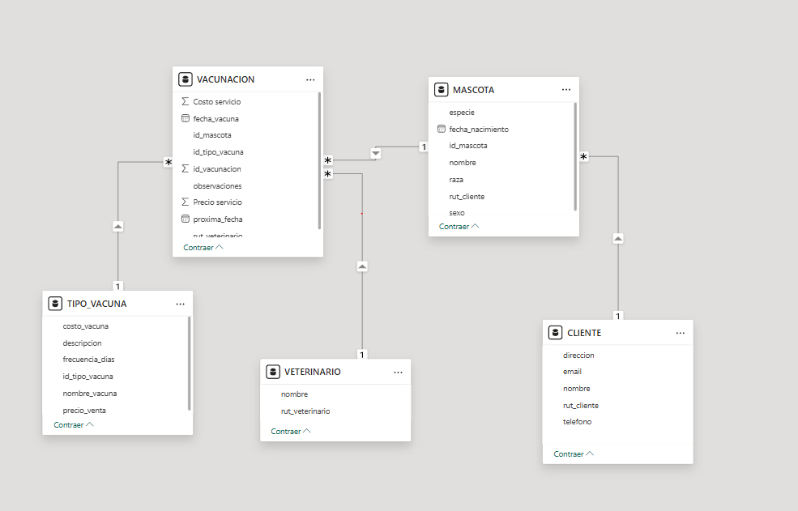
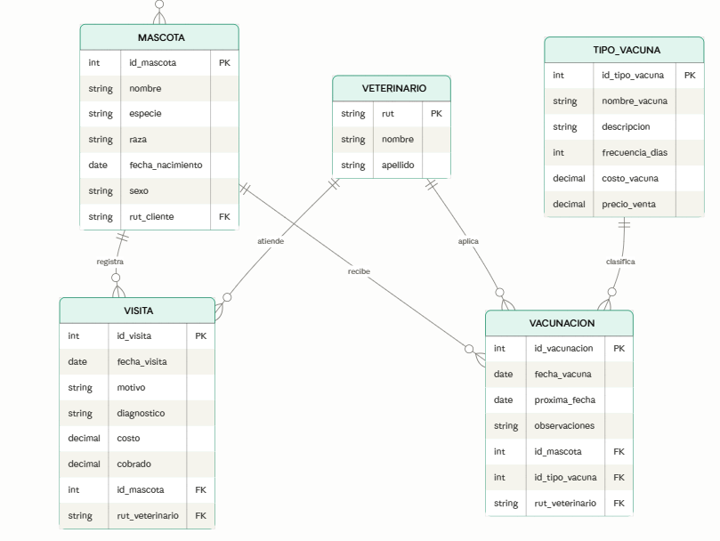

# Sistema de Inteligencia de Negocios para una Clínica Veterinaria (Power BI)

Caso de estudio de **Business Intelligence** end-to-end: desde planillas Excel desconectadas hasta un **modelo relacional** y un tablero en **Power BI** que responde preguntas de negocio sobre retención de clientes y seguimiento de vacunas.

> Proyecto académico para una clínica veterinaria real de la Región Metropolitana (Chile). **Los datos del cliente son confidenciales y no se incluyen en este repositorio**; todo lo que se muestra aquí es el diseño del sistema, la metodología y un dataset **sintético** para reproducir el modelo. Equipo: Tomás Allende · Juan Costa · Felipe Castillo · Vicente Lagunas.

---

## 🎯 Problema de negocio

La clínica **pierde clientes** porque no cuenta con un sistema que recuerde cuándo vacunar a cada mascota: muchos pacientes no regresan por falta de seguimiento. Los datos de clientes, mascotas, visitas y vacunas vivían en **planillas Excel desconectadas**, sin valor analítico.

## 📊 KPIs solicitados

- **% de mascotas con vacunas vencidas o próximas a vencer**
- **Tasa de retención de clientes** (activos en los últimos 12 meses)
- **Ingresos potenciales no capturados** por falta de seguimiento

## 🗃️ La empresa en números

| Entidad | Registros |
|---|---|
| Clientes | 7.266 |
| Mascotas | 10.357 |
| Visitas (12 meses) | 4.452 |
| Vacunaciones | 1.060 |
| Veterinarios | 6 |
| Tipos de vacuna | 15 |

## 🏗️ Modelo de datos

Se diseñó un **esquema relacional** (modelo estrella) conectando las entidades del negocio:





| Relación | Cardinalidad | Regla de negocio |
|---|---|---|
| Cliente → Mascota | 1:N | Un cliente puede tener muchas mascotas. |
| Mascota → Vacunación | 1:N | Una mascota acumula muchos registros de vacunación. |
| Veterinario → Vacunación | 1:N | Un veterinario aplica muchas vacunas. |
| Tipo_Vacuna → Vacunación | 1:N | Un tipo de vacuna aparece en muchos registros. |
| Mascota → Visita | 1:N | Una mascota tiene muchas visitas. |

## 🧹 Proceso (ETL + modelado)

1. **Consolidación** de múltiples planillas Excel en una base única.
2. **Limpieza** con Power Query: eliminación de nulos y duplicados, normalización de formatos y categorías mal escritas.
3. **Anonimización**: en el proyecto original se modificó el RUT de las personas para proteger su privacidad. *(En este repositorio, además, no se publica ningún dato real.)*
4. **Atributos derivados** para vincular entidades y calcular los KPIs (p. ej. estado de vacuna según `proxima_fecha`).
5. **Modelo relacional** y visualizaciones ejecutivas en **Power BI Desktop**.

## 🧪 Dataset sintético reproducible

Como los datos reales son confidenciales, este repo incluye un generador de datos **100% sintéticos** que respeta el esquema:

```bash
python generate_sample_data.py   # genera CSVs en ./data/
```

Con esos CSVs puedes reconstruir el modelo en Power BI o explorarlo con pandas y recrear los KPIs. Ver [`data/README.md`](data/README.md) para el diccionario de datos.

## 🧰 Stack

`Power BI Desktop` · `Power Query` · `Excel` · modelado relacional (estrella) · `Python` (dataset sintético)

---

> **Privacidad:** este repositorio **no contiene** nombres, teléfonos, correos, direcciones ni RUT de clientes reales. Solo diseño, metodología y datos sintéticos.
